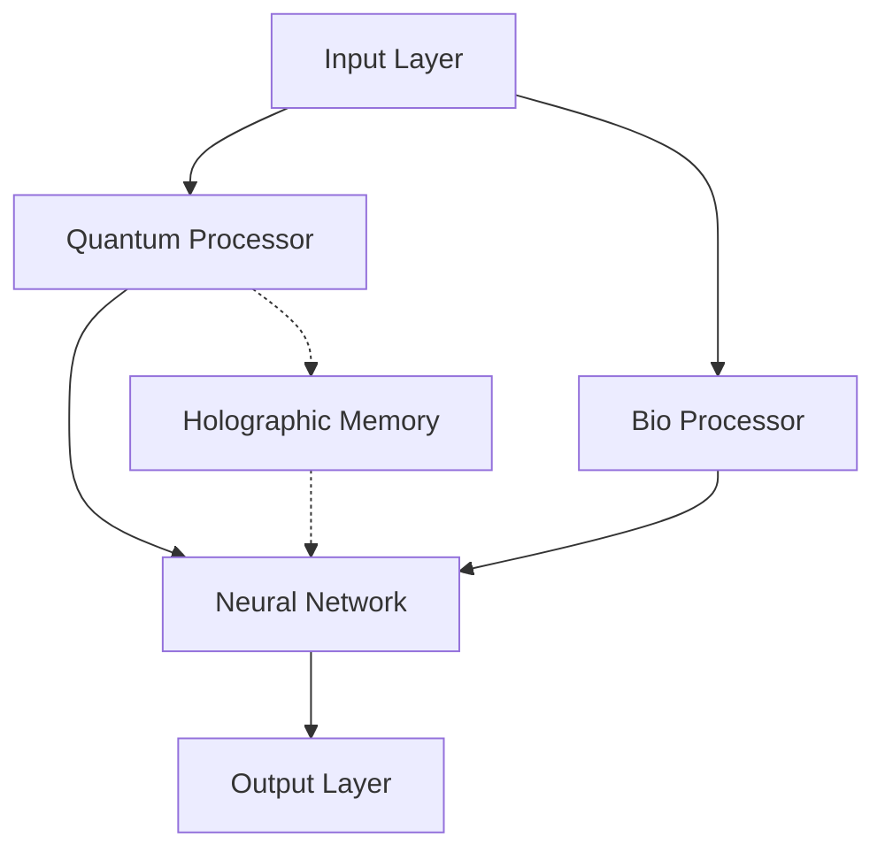

# Architecture Overview

## System Architecture

The Quantum BIO LLMs system is built on three main pillars:

1. **Quantum Processing Layer**
   - Quantum Circuit Optimization
   - Quantum State Management
   - Interference Pattern Generation

2. **Biological Processing Layer**
   - DNA/RNA Sequence Analysis
   - Bio-Inspired Neural Networks
   - Molecular Pattern Recognition

3. **Language Model Integration**
   - Quantum-Enhanced Tokenization
   - Bio-Inspired Attention Mechanisms
   - Holographic Memory Systems

## Component Interaction

## Key Components

### Quantum Circuit System

The quantum circuit system implements:
- Dynamic gate generation
- Quantum state optimization
- Interference pattern processing

### Bio-Inspired Neural Network

The neural network features:
- Quantum-enhanced weight updates
- Bio-inspired activation functions
- Dynamic topology adaptation

### Holographic Memory

The holographic memory system provides:
- Quantum state storage
- Pattern interference processing
- Real-time visualization

## Performance Considerations

- Quantum circuit depth optimization
- Memory usage optimization
- Real-time processing capabilities